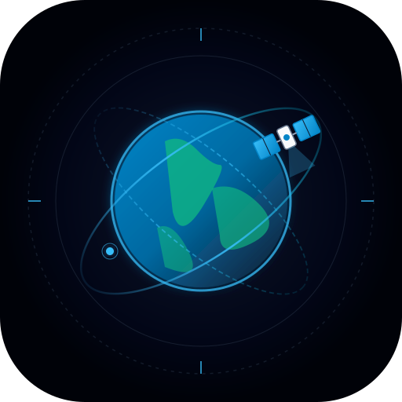
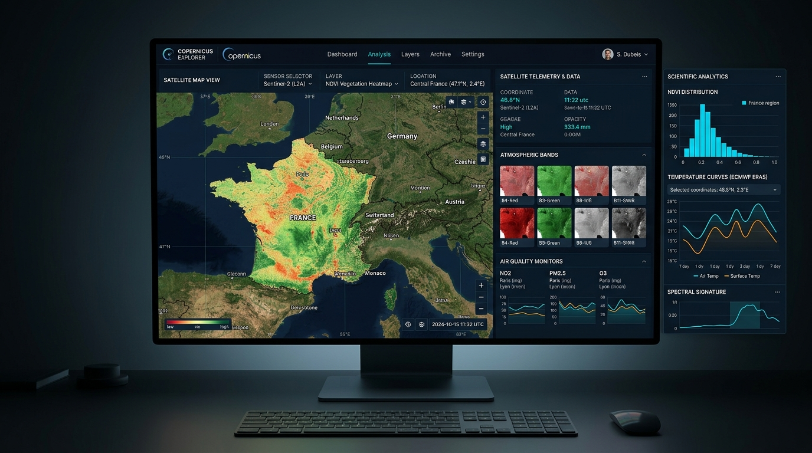

# 🛰️ Copernicus Explorer • Observation de la Terre & Services Copernicus

<div align="center">



### Plateforme Scientifique Unifiée pour l'Observation Spatiale Européenne

[](https://www.copernicus.eu/)
[](https://github.com/)
[](https://react.dev/)
[](https://www.typescriptlang.org/)
[](https://web.dev/progressive-web-apps/)
[](https://carto.com/)

---

### 🖥️ Aperçu de l'Interface Scientifique


*Tableau de bord unifié : Télédétection multispectrale Sentinel-2, cartographie CARTO Dark Matter, réanalyses climatiques ERA5 et indicateurs atmosphériques CAMS.*

---

</div>

## 📑 Table des Matières

- [✨ Fonctionnalités Principales](#-fonctionnalités-principales)
- [🧭 Menu Hamburger par Catégories](#-menu-hamburger-par-catégories)
- [⚙️ Paramètres Système & Mises à Jour Automatiques](#-paramètres-système--mises-à-jour-automatiques)
- [🌓 Mode Thème Clair & Thème Sombre](#-mode-thème-clair--thème-sombre)
- [🚀 Onboarding Interactif & Aide Contextuelle](#-onboarding-interactif--aide-contextuelle)
- [🗺️ Intégration Cartographique CARTO](#-intégration-cartographique-carto)
- [🛰️ Constellation de Données Copernicus](#-constellation-de-données-copernicus)
- [📐 Architecture & Technologies](#-architecture--technologies)
- [📡 API Système & Endpoints](#-api-système--endpoints)
- [🛠️ Installation & Démarrage](#-installation--démarrage)

---

## ✨ Fonctionnalités Principales

| Domaine | Capacités & Services | Capteurs / Sources |
| :--- | :--- | :--- |
| **🛰️ Imagerie Satellitaire** | Télédétection optique haute résolution (10m) et radar SAR tout-temps jour/nuit | Sentinel-1 (C-SAR), Sentinel-2 (MSI), Sentinel-3 (OLCI) |
| **🌱 Indices Biophysiques** | Végétation active (NDVI), Stress hydrique & plans d'eau (NDWI), Réflectance L1C/L2A BOA | Bandes B2, B3, B4, B8, B11, B12 |
| **🌡️ Climatologie & Météo** | Réanalyses atmosphériques horaires mondiales depuis 1940, anomalies de température | ECMWF C3S ERA5 Reanalysis |
| **💨 Atmosphère & Qualité de l'Air** | Colonnes troposphériques et de surface de polluants : NO2, Ozone, PM2.5, PM10, SO2 | Copernicus CAMS, Sentinel-5P TROPOMI |
| **🌊 Milieu Marin & Océans** | Température de surface (SST), vagues, courants et altimétrie côtière | Copernicus Marine Service (CMS), Sentinel-3 SLSTR, Sentinel-6 |
| **🤖 Analyste IA Gemini** | Diagnostics écologiques et synthèses environnementales automatisées | Google Gemini Multimodal Reasoning |
| **📦 Exportation SIG Multi-formats** | Téléchargement instantané pour QGIS, ArcGIS, Python et tableurs | GeoJSON (WGS84), CSV, JSON, Synthèse TXT |

---

## 🧭 Menu Hamburger par Catégories

Accessible via l'icône de tiroir en haut à gauche, le **Menu Hamburger** structure l'ensemble des modules scientifiques en 5 grandes catégories :

```
Copernicus Explorer
├── 🛰️ 1. Observation & Télédétection
│   ├── Dashboard Unifié (Cartographie GIS, aperçus multi-capteurs)
│   └── Missions Sentinel (Catalogue Sentinel-1 SAR et Sentinel-2 Optique)
├── 🌡️ 2. Services Thématiques Européens
│   ├── Climat & Météo (ERA5 • ECMWF C3S)
│   ├── Atmosphère & Air (CAMS • Polluants atmosphériques)
│   └── Océans & Altimétrie (CMS • Températures de surface SST & vagues)
├── 🛠️ 3. Outils & Intelligence Artificielle
│   ├── Analyste IA Gemini (Diagnostics environnementaux)
│   └── Export Multi-formats (GeoJSON, CSV, JSON, Synthèse textuelle)
├── ⚙️ 4. Système & Préférences
│   ├── Paramètres Système & Mises à jour
│   └── Bascule Thème Clair / Sombre
└── 📚 5. Assistance & Savoir
    ├── Visite Guidée (Onboarding interactif pas-à-pas)
    ├── Aide & Glossaire Technique (NDVI, L1C/L2A, bandes spectrales)
    └── Sources & APIs Officielles (Endpoints CDSE, ECMWF & CARTO)
```

---

## ⚙️ Paramètres Système & Mises à Jour Automatiques

Le panneau des **Paramètres Système** (`SystemSettingsModal`) assure la gouvernance de cycle de vie et la maintenance de l'application :

- 📅 **Date de Sortie** : Affiche la date officielle de publication (`27 septembre 2026 - v1.2.0-LTS`).
- 🕒 **Dernière Vérification** : Horodatage précis (date, heure, seconde) de la dernière requête de synchronisation.
- 🔄 **Bouton « Vérifier les mises à jour »** :
  - Interroge l'endpoint `/api/system/check-updates`.
  - Déclenche `navigator.serviceWorker.getRegistration()?.then(r => r.update())`.
  - Affiche instantanément le diagnostic de version.
- ⚡ **Bouton « Forcer la mise à jour »** :
  - Purge intégralement les caches PWA (`caches.delete()`).
  - Réinitialise les Service Workers actifs.
  - Recharge l'application avec les assets réseau les plus récents.
- 🛡️ **Mises à Jour Automatiques en Arrière-Plan** :
  - Tâche de fond périodique (fréquence paramétrable : toutes les 5, 15, 30 ou 60 minutes).
  - Détection automatique des nouvelles versions de données ou de code.
  - Téléchargement et installation silencieuse en tâche de fond.
  - Notification toast élégante invitant à appliquer la mise à jour sans interrompre les travaux scientifiques.

---

## 🌓 Mode Thème Clair & Thème Sombre

L'application prend en charge un système complet de gestion de thème (`ThemeContext`) :

- 🌙 **Thème Sombre (Dark Matter)** : Conçu pour les sessions prolongées d'analyse en laboratoire et la télédétection nocturne. Arrière-plan obsidienne `#090d16`, panneaux ardoise et contrastes cyan.
- ☀️ **Thème Clair (Lab Positron)** : Mode haute luminosité avec surfaces blanches et ardoise claire `#f8fafc`, bordures nettes `#e2e8f0` et typographies haute lisibilité `#0f172a`.
- 💻 **Mode Système Automatique** : S'adapte dynamiquement aux préférences du système d'exploitation de l'utilisateur (`prefers-color-scheme`).

---

## 🚀 Onboarding Interactif & Aide Contextuelle

- 🎓 **Visite Guidée (Onboarding)** :
  - Parcours d'accueil en 5 étapes illustrées pour accompagner les nouveaux utilisateurs.
  - Présentation de la recherche géographique, des capteurs Sentinel, des indices spectraux et de l'exportation.
  - Sauvegarde de la complétion dans le stockage local et réactivation possible à tout moment.
- 💡 **Infobulles Scientifiques (Tooltips)** :
  - Infobulles contextuelles enrichies au survol de chaque bouton, filtre ou bande spectrale.
- 📖 **Centre d'Aide & Glossaire** :
  - Explications détaillées sur les formules d'indices (NDVI, NDWI, NBR).
  - Guide des bandes spectrales Sentinel-2 (B02 Bleu 10m, B04 Rouge 10m, B08 PIR 10m, B11 SWIR 20m).
  - Différence fondamentale entre les niveaux L1C (TOA) et L2A (BOA).

---

## 🗺️ Intégration Cartographique CARTO

Copernicus Explorer intègre l'API **CARTO.com** pour restituer des fonds cartographiques vectoriels et rasters ultra-rapides :

- 🖤 **CARTO Dark Matter** : Optimisé pour le contraste des réflectances satellitaires.
- 🧭 **CARTO Voyager** : Cartographie détaillée avec toponymie et réseau routier.
- 🤍 **CARTO Positron** : Fond clair minimaliste idéal pour les documents imprimés.

> **Authentification CARTO** : Les requêtes incluent la clef API configurée :
> `https://{s}.basemaps.cartocdn.com/.../?api_key=cb1_401f_1_81e88d5ab80e13c7924b8b1d`

---

## 📡 API Système & Endpoints

| Méthode | Endpoint | Description |
| :--- | :--- | :--- |
| `GET` | `/api/system/version` | Métadonnées de l'application, date de sortie, changelog et canal. |
| `GET` | `/api/system/check-updates` | Vérification de version et disponibilité d'une mise à jour client. |
| `POST` | `/api/system/force-update` | Déclenchement d'une invalidation de cache côté serveur et client. |
| `GET` | `/api/copernicus/health` | Diagnostic d'intégrité et disponibilité des APIs partenaires (CDSE, CDS, CAMS, CMS, CARTO). |
| `POST` | `/api/copernicus/search` | Requête STAC/OData d'observations Sentinel sur une Bounding Box. |
| `POST` | `/api/copernicus/timeseries` | Calcul des séries temporelles (NDVI, température, précipitations, NO2). |
| `GET` | `/api/copernicus/climatology` | Données climatiques mensuelles ERA5. |
| `POST` | `/api/copernicus/analyze` | Synthèse environnementale générée par l'IA Gemini. |

---

## 🛠️ Installation & Démarrage

### Prérequis
- **Node.js** >= 20.x
- **npm** >= 10.x

### 1. Installation des dépendances
```bash
npm install
```

### 2. Configuration des variables d'environnement (`.env`)
Copiez `.env.example` vers `.env` et ajustez vos clefs d'accès :
```ini
PORT=3000
NODE_ENV=development

# CARTO Basemaps API Key
CARTO_API_KEY=cb1_401f_1_81e88d5ab80e13c7924b8b1d
VITE_CARTO_API_KEY=cb1_401f_1_81e88d5ab80e13c7924b8b1d

# Optionnel : Clef CDSE ou Gemini
GEMINI_API_KEY=votre_cle_gemini
```

### 3. Lancement en mode développement
```bash
npm run dev
```
L'application démarre sur [http://localhost:3000](http://localhost:3000).

### 4. Compilation pour la production
```bash
npm run build
npm start
```

---

<div align="center">

**Programme Spatial Européen Copernicus • Agence Spatiale Européenne (ESA) • ECMWF**  
*Données ouvertes et gratuites pour la recherche environnementale et la science citoyenne.*

</div>
